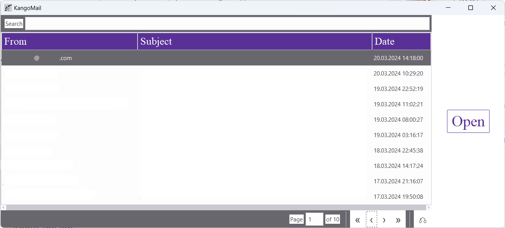

# Kango-Mail
A desktop mail client project  

Currently the project doesn't offer much, it will be updated.


<h1> How to run?</h1>
- First, add the IMAP server you want to connect to the main.py file.  

Currently not using XOAUTH2, so, you can't connect to ones using XOAUTH2, like your gmail account.  

<br />

```
pip install -r requirements.txt
python main.py
```

<h1> Images </h1>

<p float="left">
  
   
</p>

